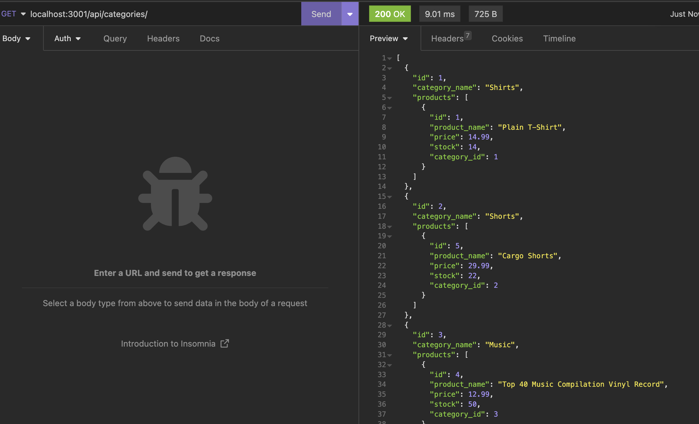
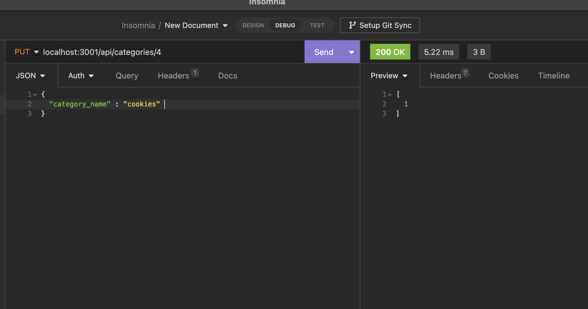
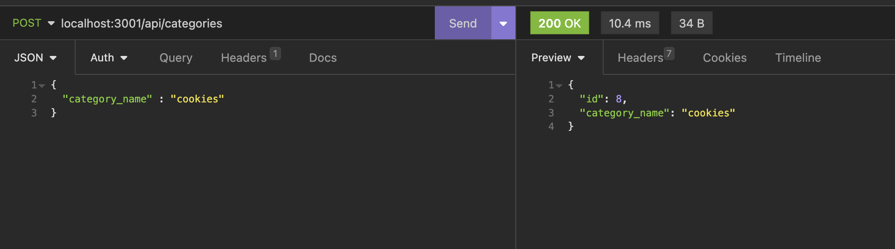
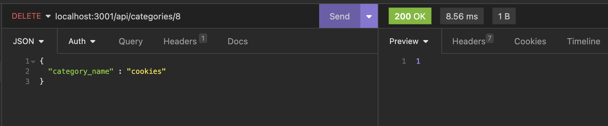

# E-COMMERCE BACK END 

## DESCRIPTION

To create a back end for a e-commerce website that uses the latest technologies.

## USAGE

Given a functional Express.js API ,when you add database name, MySQL username, and MySQL password to an environment variable file,then you are able to connect to a database using Sequelize.

When you enter schema and seed commands,Then a development database is created and is seeded with test data.

When you enter the command to invoke the application,Then the server is started and the Sequelize models are synced to the MySQL database.

When you open API GET routes in Insomnia for categories, products, or tags,Then the data for each of these routes is displayed in a formatted JSON.

When you test API POST, PUT, and DELETE routes in Insomnia,Then you are able to successfully create, update, and delete data in my database.

## INSTALLATION

1.Insomnia needed to be installed to test the app.

## SCREENSHOT

1. GET request for category

2. GET request for fetching one category by id

3. PUT request for category

4. POST request for category

5. DELETE request for category

## WALKTHROUGH VIDEO

https://github.com/priyankav89/ecommerce/assets/127457597/e2e4596a-2e43-4762-8b62-83f548def937

## TESTING

1. npm i code is used to install the package.json .
2. mysql -u root is used to start the mysql .
3. source schema.sql is used to run the schema file.
4. quit command is used to exit the mysql.
5. To run the seeds file node seeds/index.js is used.
6. node server.js is used to test the file.
7. all api routes can be tested using Insomnia.

## LICENSE

